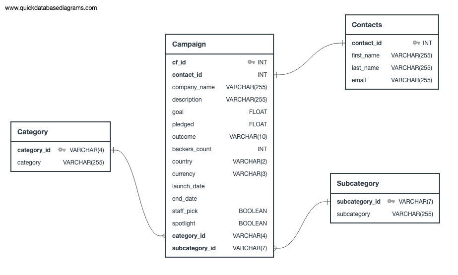
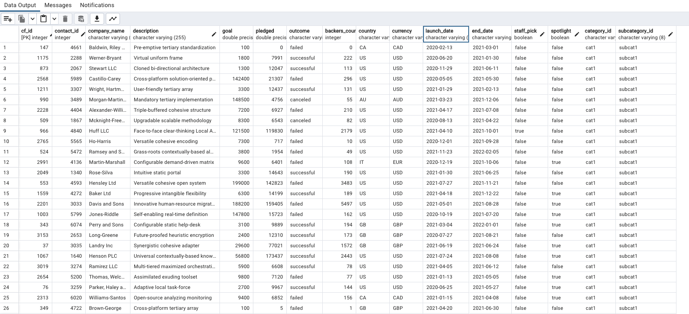
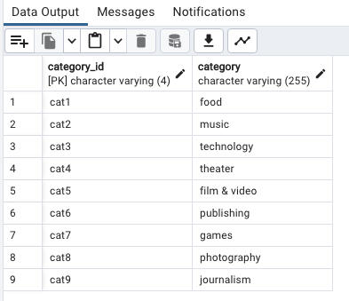
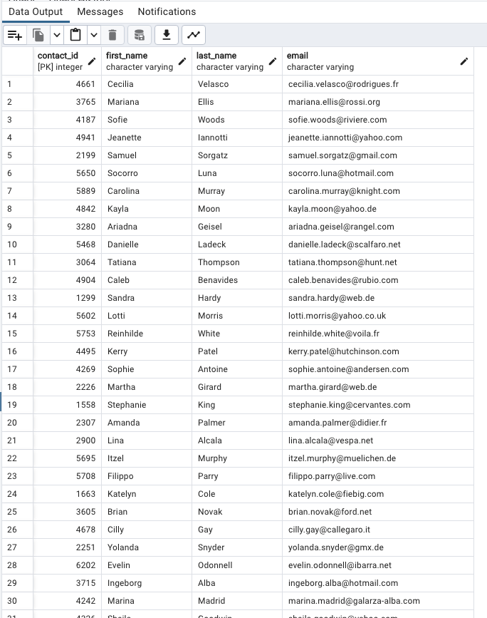
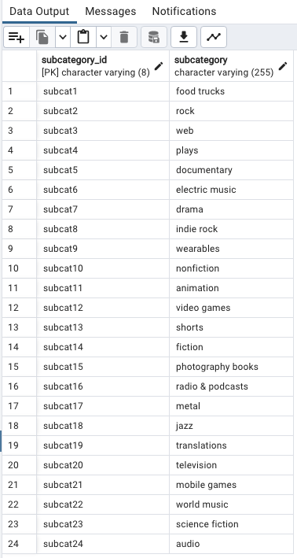

# Crowdfunding_ETL
## Table of Contents

- [Instructions](#instructions)
- [Contents of the Repository](#repository_contents)
- [Tables](#tables)
- [Givens](#givens)

## Instructions
For the ETL mini project, you will work with a partner to practice building an ETL pipeline using Python, Pandas, and either Python dictionary methods or regular expressions to extract and transform the data. After you transform the data, you'll create four CSV files and use the CSV file data to create an ERD and a table schema. Finally, you’ll upload the CSV file data into a Postgres database.   
Since this is a one-week project, make sure that you have done at least half of your project before the third day of class to stay on track.  
Although you and your partner will divide the work, it’s essential to collaborate and communicate while working on different parts of the project. Be sure to check in with your partner regularly and offer support.

## Repository_Contents
There are 2 coding deliverables. The first is ETL_Mini_Project_RWheliss_BHill.ipynb which contains the formatting of the database into a workable format. The second is crowdfunding_db_schema.sql which adds the data into a SQL format. 
There are 6 csvs in the Resources folder but 4 of those were constructed by our group. Those csvs were campaign.csv, category.csv, subcategory.csv and contacts.csv.  
The below ERD Diagram was also created. 

## Tables
Campaign Table  

Category Table  

Contacts Table  

SubCategory Table  

## Givens
Ryland and Brittney wrote the code for this project 
Brittney wrote the code for the Category and Subcategory Tables 
Ryland wrote the code for the Campaign and Contacts Tables 
Paired Programming was used to write the SQL file, write the README and take the screenshots 
    
Data for this dataset and instructions were generated by edX Boot Camps LLC, and is intended for educational purposes only.
